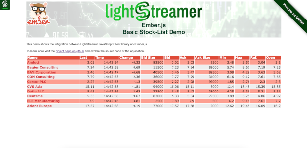

# Lightstreamer - Basic Stock-List Demo - HTML (EmberJS) Client

<!-- START DESCRIPTION lightstreamer-example-stocklist-client-ember -->

A simple stocklist demo application showing integration between the [EmberJS](http://emberjs.com) framework and the <b>Lightstreamer JavaScript Client library</b>.

## Live Demo

[](http://demos.lightstreamer.com/EmberJSDemo)<br>
###[ View live demo](http://demos.lightstreamer.com/EmberJSDemo)<br>

## Details

This demo displays real-time market data for ten stocks, generated by a feed simulator in a similar way to the [Lightstreamer - Basic Stock-List Demo - HTML Client](https://github.com/Weswit/Lightstreamer-example-StockList-client-javascript#basic-stock-list-demo---html-client).<br>

This page uses the <b>JavaScript Client API for Lightstreamer</b> to handle the communications with Lightstreamer Server and uses <b>EmberJS</b> to display the real-time data pushed by Lightstreamer Server.

A Lightstreamer Subscription is used for subscribing to the data. The onItemUpdate callback takes care of updating the model that backs the application template: once a new item event 
comes from the server, a lookup from the local store is performed to retrieve the matching object in order to update its properties, according to the modified item field values.
Finally, changes applied to the model will be automatically reflected by the framework in the HTML page.

The demo includes the following client-side functionalities:
* A [Subscription](http://www.lightstreamer.com/docs/client_javascript_uni_api/Subscription.html) containing 10 items, subscribed to in **MERGE** mode.

<!-- END DESCRIPTION lightstreamer-example-stocklist-client-ember -->

## Install

If you want to install a version of this demo pointing to your local Lightstreamer Server, follow these steps:

* Note that, as prerequisite, the [Lightstreamer - Stock- List Demo - Java Adapter](https://github.com/Weswit/Lightstreamer-example-Stocklist-adapter-java) has to be deployed on your local Lightstreamer Server instance. Please check out that project and follow the installation instructions provided with it.
* Launch Lightstreamer Server.
* Download this project.
* Deploy this demo on the Lightstreamer Server (used as Web server) or in any external Web Server. If you chose the former case, please create the folders <LS_HOME>/pages/demos/EmberJSDemo
then copy there the contents of the `/src` folder of this project. The client demo configuration assumes that Lightstreamer Server, Lightstreamer Adapters and this client are launched on the same machine.
If you need to target a different Lightstreamer server, please search this line:
```js
var lsClient = new LightstreamerClient(protocolToUse + "//localhost:8080", "DEMO");
```
in `lsClient.js` and change it accordingly.
* Lightstreamer JS client, RequireJS, EmberJS (and all its dependencies) are currently hot-linked in the HTML page: you may want to replace them with a local version and/or upgrade ther version

The demo is now ready to be launched.

## See Also

### Lightstreamer Adapters Needed by This Demo Client

* [Lightstreamer - Stock-List Demo - Java Adapter](https://github.com/Weswit/Lightstreamer-example-Stocklist-adapter-java)
* [Lightstreamer - Reusable Metadata Adapters - Java Adapter](https://github.com/Weswit/Lightstreamer-example-ReusableMetadata-adapter-java)

### Related Projects

* [Lightstreamer - Stock-List Demos - HTML Clients](https://github.com/Weswit/Lightstreamer-example-Stocklist-client-javascript)

## Lightstreamer Compatibility Notes

- Compatible with Lightstreamer JavaScript Client library version 6.0 or newer.
